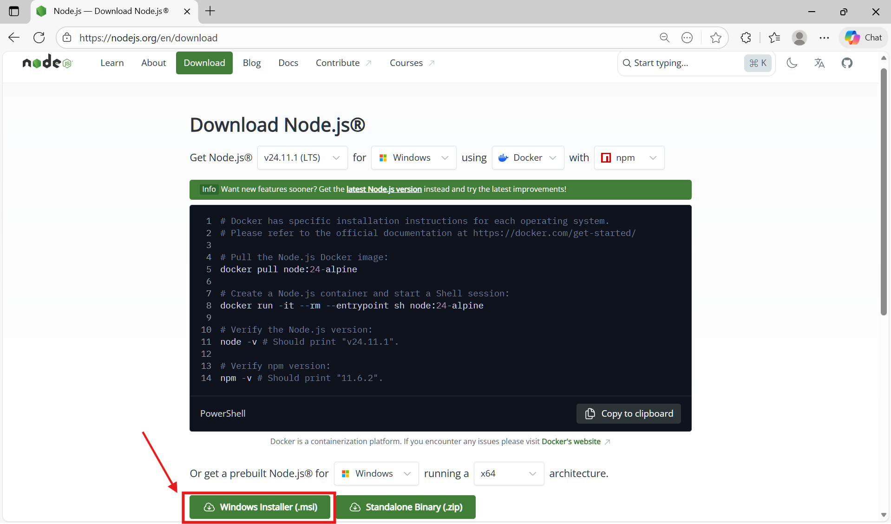
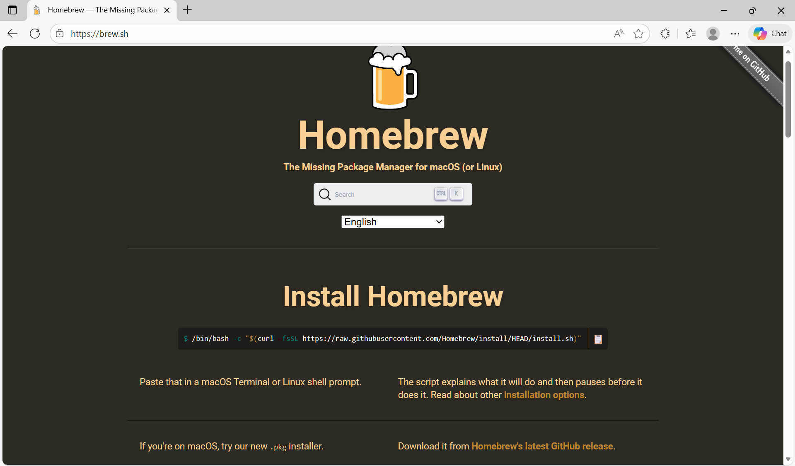

# Chapter 4: Setup and Prerequisites

You need accounts and tools before starting. This chapter gets you set up.

**Time required:** 30-45 minutes

**Cost:** $20/month for Claude Pro. Everything else is free.

## Accounts You Need

All these accounts are free to create. Use "Continue with GitHub" for easier signup.

### 1. GitHub Account

Go to [github.com/signup](https://github.com/signup)
- Create account (if you don't have one)
- Remember your username - you'll use it everywhere

### 2. v0 Account

Go to [v0.dev](https://v0.dev)
- Click "Sign up"
- Choose "Continue with GitHub"
- Authorize v0

**Free tier:** 200 credits/month (enough for 20 designs)

### 3. Supabase Account

Go to [supabase.com](https://supabase.com)
- Click "Start your project"
- Choose "Continue with GitHub"
- Authorize Supabase

**Free tier:** 2 projects, 500MB database each

### 4. Vercel Account

Go to [vercel.com](https://vercel.com)
- Click "Sign Up"
- Choose "Continue with GitHub"
- Authorize Vercel

**Free tier:** Unlimited deployments

### 5. Claude Pro

Go to [claude.ai](https://claude.ai)
- Sign in (or create account)
- Click "Upgrade to Pro"
- Subscribe ($20/month)

**Why you need it:** Claude Pro unlocks Claude Code CLI.

**Verify:** Go to [claude.ai/code](https://claude.ai/code) - you should see "Download Claude Code"

## Tools You Need

### Install Node.js

**<ins>Windows:</ins>**
1. In the search bar, search for the "Windows Powershell" application and open it.

2. Verify that the package manager **WinGet** is installed on your computer. Type
**Check if you have it:**
```bash
node --version
```

If you see v18 or v20+, proceed to "Installing Git".
Otherwise, download from the Windows Installer of [Node.js Home Page](https://nodejs.org/en/download).



**<ins>macOS:</ins>**

1. In the search bar, search for the "Terminal" application and open it.

2. Verify that the package manager **Homebrew** is installed on your computer. Type
```bash
brew --version
```

If it's installed, the output would display the application version number WITHOUT an error message.
```bash
Homebrew 4.4.32
```
which you can move onto Step 3. Otherwise, install Homebrew through this [website](https://brew.sh/).



3. Once Homebrew is installed, install Node.js by issuing the following command.
```bash
brew install node
```

**<ins>Linux/WSL:</ins>**
```bash
curl -fsSL https://deb.nodesource.com/setup_20.x | sudo -E bash -
sudo apt install -y nodejs
```

**Verify:**
```bash
node --version
npm --version
```

### Install Git

**Check if you have it:**
```bash
git --version
```

If you see version 2.x+, skip to configuration.

**macOS:**
```bash
xcode-select --install
```

**Linux/WSL:**
```bash
sudo apt install git -y
```

**Configure (everyone must do this):**
```bash
git config --global user.name "Your Name"
git config --global user.email "your@email.com"
```

Use the same email as your GitHub account.

### Install GitHub CLI

**macOS:**
```bash
brew install gh
```

**Linux/WSL:**
```bash
curl -fsSL https://cli.github.com/packages/githubcli-archive-keyring.gpg | sudo dd of=/usr/share/keyrings/githubcli-archive-keyring.gpg
echo "deb [arch=$(dpkg --print-architecture) signed-by=/usr/share/keyrings/githubcli-archive-keyring.gpg] https://cli.github.com/packages stable main" | sudo tee /etc/apt/sources.list.d/github-cli.list > /dev/null
sudo apt update
sudo apt install gh -y
```     
   
## Login:
```bash
gh auth login
```

Choose:
1. GitHub.com
2. HTTPS
3. Login with a web browser
4. Follow prompts

### Install Claude Code

**macOS/Linux/WSL:**
```bash
curl -fsSL https://claude.ai/install.sh | bash
```

**Windows**
```bash
irm https://claude.ai/install.ps1 | iex
```

**Verify:**
```bash
claude-code --version
```

If "command not found", close terminal completely and open a new one.

**First run (authenticate):**
```bash
claude-code
```

Browser opens. Click "Authorize". Return to terminal.

### Install Superpowers Plugin

In Claude Code prompt (`>`):
```
/plugin marketplace add obra/superpowers-marketplace
/plugin install superpowers@superpowers-marketplace
```

**Verify:**
```
/plugins list
```

You should see:
```
Installed plugins:
- superpowers (from obra/superpowers)
```

Type `exit` to close Claude Code.

## Windows Users: Install WSL First

**Claude Code doesn't run on Windows natively. You need WSL (Windows Subsystem for Linux).**

Open PowerShell as Administrator:
```powershell
wsl --install
```

Restart computer when prompted.

After restart, Ubuntu opens. Create username and password.

Then run all the Linux/WSL commands above in the Ubuntu terminal.

**Important:** Store your projects in Linux filesystem for speed:
```bash
cd ~
mkdir projects
cd projects
```

Don't use `/mnt/c/` - it's slow through WSL.

## Verification Checklist

Run this to check everything:

```bash
echo "Node.js: $(node --version)"
echo "npm: $(npm --version)"
echo "Git: $(git --version)"
echo "Claude Code: $(claude-code --version)"
echo "GitHub CLI: $(gh --version)"
```

**In Claude Code:**
```
claude-code
/plugins list
```

Should show superpowers installed.

## Troubleshooting

**"Command not found" after install:**
Close terminal completely. Open new one. Try again.

**Claude Code authentication fails:**
Go to [claude.ai](https://claude.ai), sign out, sign back in. Run `claude-code` again.

**npm permission errors (Linux/WSL):**
```bash
mkdir ~/.npm-global
npm config set prefix '~/.npm-global'
echo 'export PATH=~/.npm-global/bin:$PATH' >> ~/.bashrc
source ~/.bashrc
```

## Ready?

You now have:
- v0 for UI generation
- Supabase for backend
- Vercel for hosting
- Claude Code + Superpowers for AI development
- Node.js for running Next.js
- Git + GitHub CLI for version control

**Next:** Chapter 5 teaches how to use v0 to design UI components.

Chapters 5-9 teach each tool individually. Then Chapters 10-16 walk you through building ReadStack using all of them together.

The setup is done. Time to learn the workflow.
