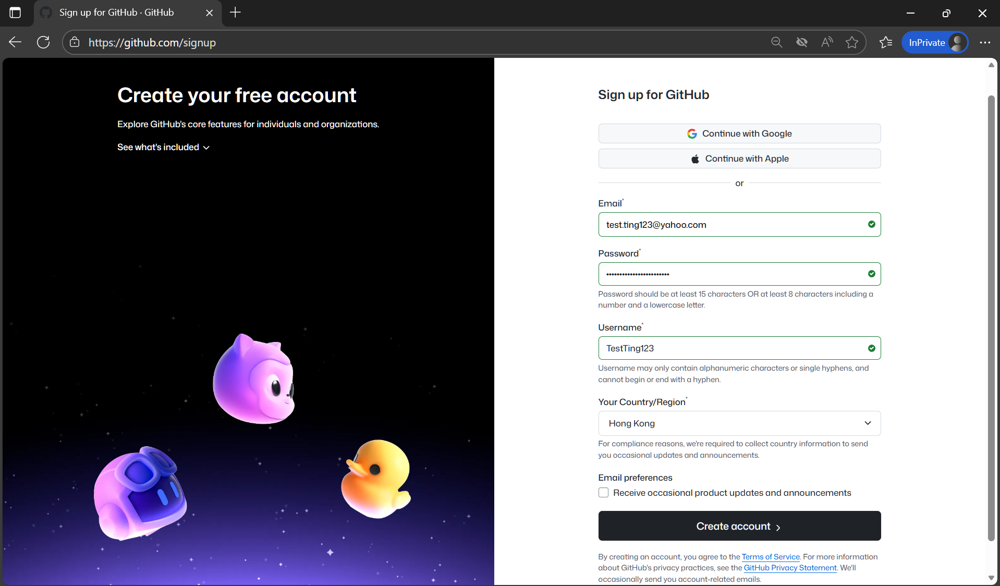
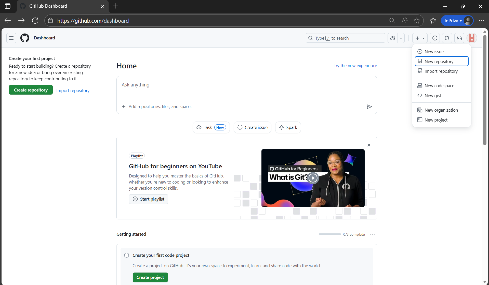
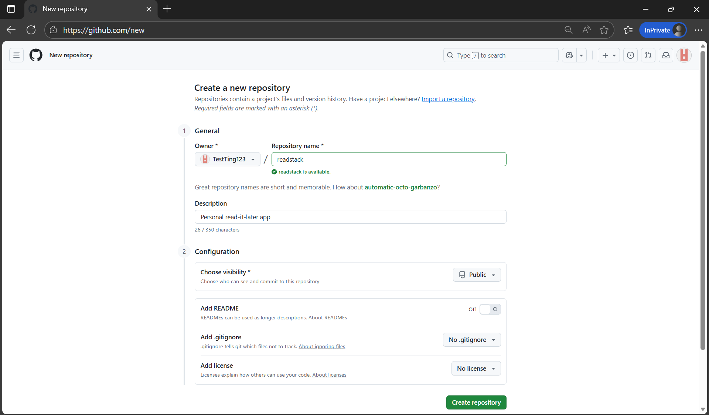
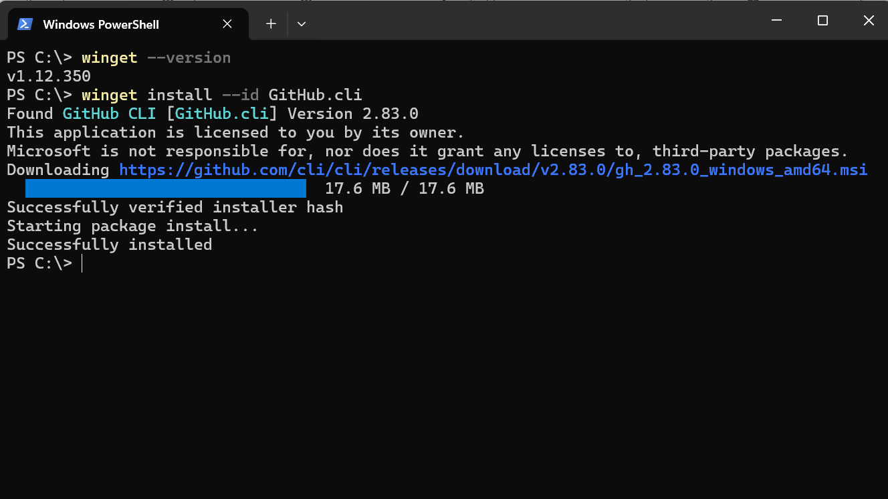
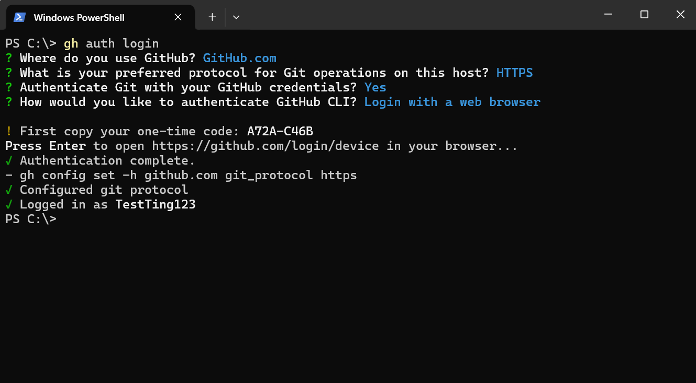
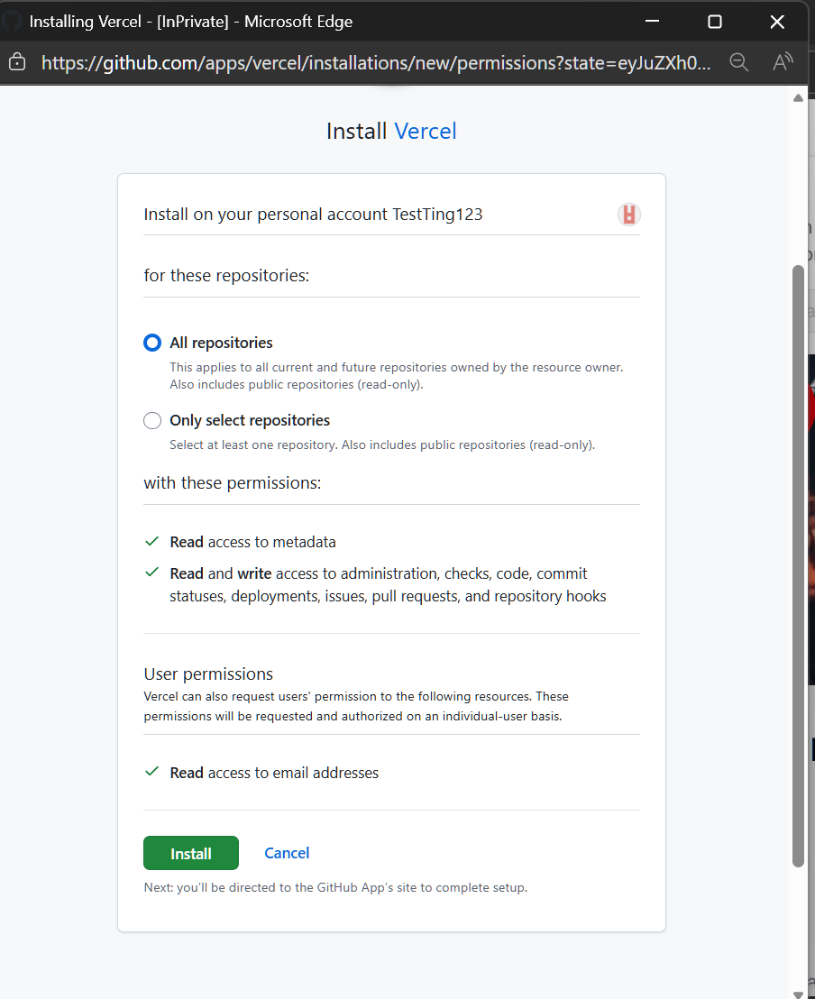
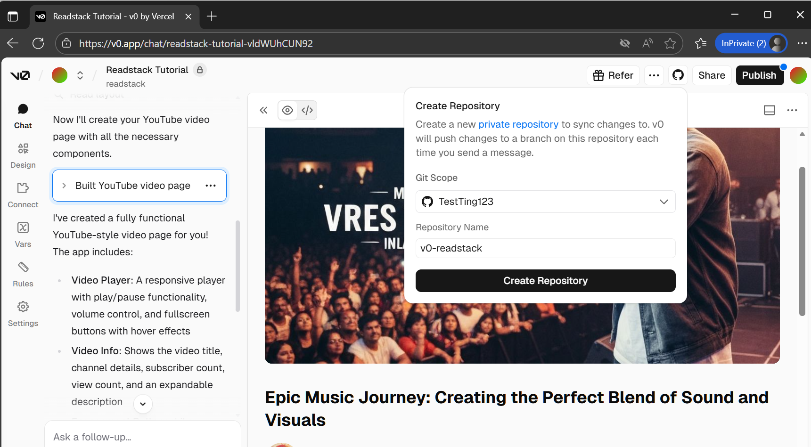

# Chapter 7: Phase 3 - GitHub Setup

Version control from day one. Not "when the project gets serious." Day one.

In this chapter, you'll connect v0 to GitHub so your code is automatically backed up and version controlled.

## Why GitHub Matters

**Without GitHub:**
- Your code lives only on v0's servers
- No history of what changed and when
- Can't deploy to Vercel (which needs GitHub)
- Can't collaborate with others later

**With GitHub:**
- Code automatically backed up
- Complete history of every change
- Deploy to Vercel with one click
- Ready for collaboration if needed

**Time investment:** 10 minutes, once.

## What You'll Need

1. GitHub account (free)
2. GitHub CLI installed on your computer
3. v0 project ready to connect

That's it. No git commands to memorize. v0 handles everything else.

## Step 1: Create GitHub Account



Go to [github.com/signup](https://github.com/signup)

1. Enter your email
2. Choose a password
3. Pick a username (appears in URLs: `github.com/yourusername`)
4. Verify you're human
5. Click "Create account"

**Username tip:** Use something professional. It'll appear in portfolio links.

**Already have an account?** Skip to Step 2.

## Step 2: Create a Repository

A repository (repo) is where your code lives on GitHub.

1. Go to [github.com/new](https://github.com/new) by clicking on the "+" button >> "New repository".


You will then land on a page where you can configure your repository settings.


2. Repository name: `readstack` (or whatever you're building)

3. Description: "Personal read-it-later app" (optional but helpful)

4. **Public** or **Private**: Your choice
   - Public: Anyone can see your code (good for portfolio)
   - Private: Only you can see it

If you're not sure, choose **Public**.

5. **Important:** Leave everything else unchecked
   - Don't add README
   - Don't add .gitignore
   - Don't add license

   (v0 will handle these automatically)

6. Click "Create repository"

**Result:** Empty repo waiting for your code. Leave the page open - you'll need it later.

## Step 3: Install GitHub CLI

The GitHub CLI (`gh`) lets v0 connect to your GitHub account securely.
This is readily installable via your computer's package manager (Homebrew for macOS, WinGet for Windows, etc.)

**<ins>Mac:</ins>**
1. In the search bar, search for the "Terminal" application and open it.

2. Verify that the package manager **Homebrew** is installed on your computer. Type
```bash
brew --version
```

If it's installed, the output would display the application version number WITHOUT an error message.
```bash
Homebrew 4.4.32
```
which you can move onto Step 3.


3. Install the GitHub CLI.
```bash
brew install gh
```

**<ins>Windows:</ins>**
1. In the search bar, search for the "Windows Powershell" application and open it.

2. Verify that the package manager **WinGet** is installed on your computer. Type
```bash
winget --version
```
If it's installed, the output would display the application version number WITHOUT an error message.
```bash
v1.12.350
```
which you can move onto Step 3.

3. Install the GitHub CLI.
```bash
winget install --id GitHub.cli
```


**Linux:**
See [cli.github.com](https://cli.github.com) for your distribution.

**Verify installation:**
```bash
gh --version
```

Should show: `gh version 2.x.x`

## Step 4: Login to GitHub CLI

Now connect the CLI to your GitHub account:

```bash
gh auth login
```

You'll see a series of prompts:

**"What account do you want to log into?"**
→ Choose: `GitHub.com`

**"What is your preferred protocol for Git operations?"**
→ Choose: `HTTPS`

**"Authenticate Git with your GitHub credentials?"**
→ Choose: `Yes`

**"How would you like to authenticate GitHub CLI?"**
→ Choose: `Login with a web browser`

**Then:**
1. Copy the one-time code shown (8 characters)
2. Press Enter
3. Browser opens to GitHub. It may ask you to log in to your GitHub account again.
4. Paste the code
5. Click "Authorize GitHub CLI"
6. Return to terminal - should show "✓ Logged in as yourusername"

**Done.** Your computer is now connected to GitHub!



## Step 5: Connect v0 to GitHub

Now the magic happens. v0 handles all git operations automatically.

1. Open your v0 project
2. Click on the **GitHub icon** in the top-right toolbar


3. Click "Connect to GitHub"
4. Allow v0 to access your GitHub account (one-time authorization)
5. Confirm GitHub access to Vercel


6. **Fill in name for your repository:** Could name it `readstack`, or whatever you want to name it.
7. **Select branch:** Keep the default (`main`)


8. Click "Connect"

**Result:** v0 creates initial commit and pushes your code to GitHub automatically.

## What Just Happened

v0 automatically:
- Initialized git in your project
- Created `.gitignore` with correct files excluded
- Made first commit with all your code
- Pushed to GitHub

**You did none of this manually.** That's the point.

**Check it worked:**
Go to your GitHub repo page (github.com/yourusername/readstack). You should see your code.

## How It Works Going Forward

Every time you make changes in v0:

1. Edit your components, add features, fix bugs
2. v0 saves changes automatically
3. Click the GitHub sync button (when ready)
4. v0 commits changes with auto-generated message
5. Changes appear in GitHub history

**No git commands.** v0 handles version control invisibly.

**Want more control?** You can write custom commit messages in v0's GitHub panel. But auto-commit works fine for solo development.

## When You'll Use GitHub Directly

**In Chapter 9 (Vercel deployment):**
Vercel connects to your GitHub repo and deploys automatically when you push changes.

**In Chapter 17+ (Playwright testing):**
You might commit test files manually using git commands. But that's later.

**For now:** v0's GitHub integration is all you need.

## Troubleshooting

**"gh: command not found"**
→ GitHub CLI didn't install. Rerun installation command.

**"Could not resolve host: github.com"**
→ Check internet connection.

**"Repository not found in v0"**
→ Refresh the page. Sometimes takes 30 seconds to appear.

**"Authentication failed"**
→ Run `gh auth logout` then `gh auth login` again.

**"v0 can't push to GitHub"**
→ Check repo isn't protected. Settings → Branches → make sure no protection rules.

## What You Learned

**GitHub account created**
Your identity on the world's largest code hosting platform.

**Repository created**
Home for your ReadStack code.

**GitHub CLI installed and authenticated**
Secure connection between your computer and GitHub.

**v0 connected to GitHub**
Automatic version control without manual git commands.

**Ready for deployment**
Vercel requires GitHub. You're set.

**Total time:** 10 minutes. Never do it again for this project.

## Next Steps

Chapter 8 teaches Phase 4: Development with Claude Code. You'll use AI to implement features with automatic testing and quality checks.

Your code is safe in GitHub. Time to build features.
